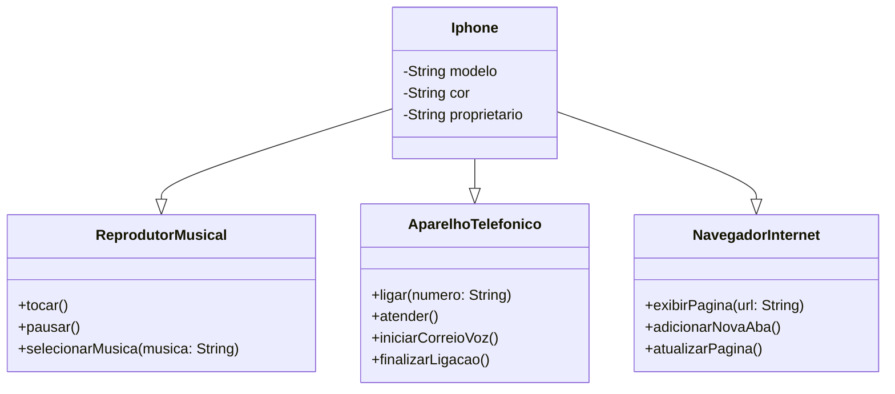

## Diagrama de Classes

```mermaid
classDiagram
  class Iphone {
    -String modelo
    -String cor
    -String proprietario
  }

  class ReprodutorMusical {
    +tocar()
    +pausar()
    +selecionarMusica(musica: String)
  }

  class AparelhoTelefonico {
    +ligar(numero: String)
    +atender()
    +iniciarCorreioVoz()
    +finalizarLigacao()
  }

  class NavegadorInternet {
    +exibirPagina(url: String)
    +adicionarNovaAba()
    +atualizarPagina()
  }

  Iphone --|> ReprodutorMusical
  Iphone --|> AparelhoTelefonico
  Iphone --|> NavegadorInternet
```
